# Cuadernillo 2 Matemática - Prueba Nacional (Junio 2024)

## Pregunta 1

Teniendo en cuenta que en un polígono regular los ángulos internos tienen la misma medida, ¿cuál de las siguientes listas muestra los polígonos ordenados de menor a mayor según la medida de sus ángulos internos?

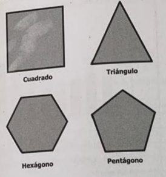

a) Triángulo, cuadrado, pentágono, hexágono. (correcta)
b) Hexágono, pentágono, cuadrado, triángulo.
c) Cuadrado, triángulo, hexágono, pentágono.
d) Pentágono, hexágono, triángulo, cuadrado.

## Pregunta 2

Se desea construir un teatro que tenga cupo para 110 personas sentadas según la propuesta mostrada en la figura. Si el teatro tendrá 11 hileras de asientos, ¿cuántas personas se sentarán en la última fila de asientos?

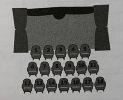

a) 10
b) 15
c) 17 (correcta)
d) 22

## Pregunta 3

En un servicio de transporte el cliente debe pagar $60 por solicitar el servicio y por cada 400 metros que recorra debe pagar $20. Un cliente pidió un servicio y al finalizar el recorrido pagó $160. ¿Cuál procedimiento permite calcular el total de metros recorridos por el cliente durante el servicio?

a) Al monto pagado restarle $60, esa cantidad multiplicaría por 400 y luego dividiría entre 20. (correcta)
b) Al monto pagado restarle $60, esa cantidad dividiría entre 400 y sumarle 20.
c) Multiplicar los 400 metros por los 20 pesos.
d) Dividir los 400 metros entre los 20 pesos.

## Pregunta 4

Una compañía de transporte tiene guaguas de diferentes colores y capacidades. En la tabla se muestra la cantidad de guaguas de cada color y la capacidad de pasajeros por guagua.

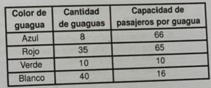

¿De qué color es la guagua con mayor capacidad que tiene la compañía?

a) Azul.
b) Rojo. (correcta)
c) Verde.
d) Blanco.

## Pregunta 5

José y Manuel han hecho helados para recaudar fondos. Las cantidades vendidas por sabores están en la primera matriz y los precios en la segunda.

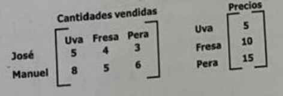

¿Cuánto dinero en total recaudaron para la institución?

a) 390 pesos. (correcta)
b) 290 pesos.
c) 180 pesos.
d) 110 pesos.

## Pregunta 6

La tabla muestra algunas características de un grupo de ballenas. Comparando la masa y longitud de machos y hembras en el grupo, ¿qué relación se puede establecer?

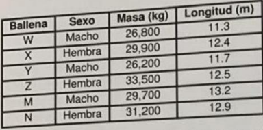

a) A mayor masa del macho, mayor es su longitud. (correcta)
b) A mayor masa de la hembra, mayor es su longitud.
c) Las hembras tienen mayor masa que los machos.
d) Las hembras tienen mayor longitud que los machos.

## Pregunta 7

Un terreno tiene rocas grises y negras, cada roca gris pesa máximo 400 gramos y cada roca negra pesa máximo 530 gramos. María recogió 12 rocas y para saber cuál es el peso máximo que podrían tener las 12 rocas, siguió esta estrategia: 1. Halló el promedio entre 400 y 530. 2. Multiplicó el promedio por 12. ¿Bajo cuál condición es válida la estrategia?

a) Que las 12 rocas sean de color negro.
b) Que haya 6 rocas grises y 6 rocas negras. (correcta)
c) Que todas las rocas grises pesen el máximo posible.
d) Que todas las rocas recogidas tengan el mismo peso.

## Pregunta 8

Carlos calculó los valores de f(x) de la función f(x) = 3x + 3 con los valores de x: -1, 0, 1, 2 pero cometió un error. ¿Con cuál valor de x se cometió un error y por qué?

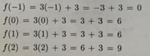

a) Con -1 porque al sumar -3 + 3 el resultado es 6.
b) Con 0, porque 3 × 0 es igual a 0, no 3. (correcta)
c) Con 1, porque 3 + 1 es igual a 4, no 3.
d) Con 2, porque 2 × 3 + 3 es igual a 6.

## Pregunta 9

El gráfico muestra la cantidad de productos que exportó una empresa entre el año 1991 y el año 2011. De acuerdo con el gráfico, desde 1991 hasta el 2007, ¿cuál fue la mayor cantidad de productos exportados en un año?

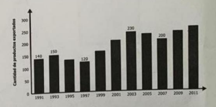

a) 120
b) 150
c) 230 (correcta)
d) 270

## Pregunta 10

El gráfico muestra un tramo de algunas avenidas principales de una ciudad. Según el gráfico, ¿cuáles de los siguientes pares de avenidas son paralelas?

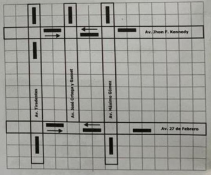

a) Av. 27 de Febrero y Av. José Ortega y Gasset.
b) Av. John F. Kennedy y Av. Tiradentes.
c) Av. 27 de Febrero y Av. John F. Kennedy. (correcta)
d) Av. Máximo Gómez y Av. John F. Kennedy.

## Pregunta 11

En una hilera de cinco casas viven cinco personas distintas: Pedro, María, Ana, Sofía y Karina. Sofía vive al lado de Pedro y en la primera casa de izquierda a derecha en la hilera. María vive al lado de Ana, pero no al lado de Pedro. Si Pedro vive al lado de Ana, ¿quién es vecino inmediato a la izquierda de Karina?

a) Sofia.
b) Pedro.
c) María.
d) Ana. (correcta)

## Pregunta 12

La Tabla 1 muestra el costo del plan y la antigüedad de cuatro clientes. 
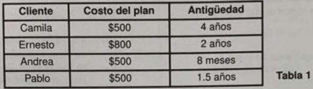

La Tabla 2 muestra el salario y el número de atrasos.
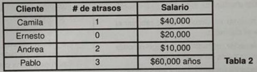

¿Cuál de las siguientes tablas muestra el costo del plan y el salario de los clientes que tienen una antigüedad mayor que un año y que hayan tenido al menos un atraso en el pago?
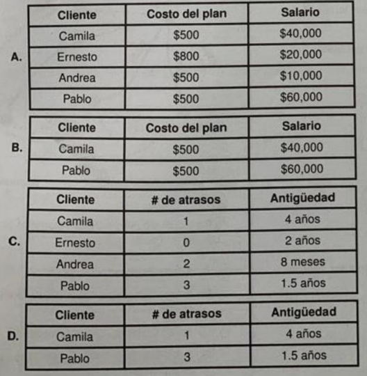

a) Tabla A.
b) Tabla B.
c) Tabla C.
d) Tabla D.

## Pregunta 13

La tabla muestra el dinero que ganó un vendedor en los tres primeros días de una semana. El vendedor calculó el promedio de su ganancia de los tres días y obtuvo que fue de $1,000. ¿Cuánto debe ganar el vendedor en el cuarto día, para que el promedio de los cuatro días sea de $1,100?

a) $1,100
b) $1,300
c) $1,400 (correcta)
d) $1,500

## Pregunta 14

Un estudiante quiere dibujar una figura geométrica en una hoja de papel y luego recortarla para obtener dos triángulos iguales. ¿Cuál de los siguientes procedimientos debe efectuar para lograr lo que quiere?

a) Dibujar y recortar un círculo y luego recortar el círculo por el diámetro.
b) Dibujar y recortar un cuadrado y luego recortar el cuadrado por una de sus diagonales. (correcta)
c) Dibujar y recortar un pentágono y luego recortar el pentágono por la línea que une dos de sus vértices.
d) Dibujar y recortar un semicírculo y luego recortar el semicírculo por el radio que forma un ángulo recto con el diámetro.

## Pregunta 15

Camilo estaba estudiando el libro de geometría y encontró 4 polígonos regulares. ¿Cuál o cuáles polígonos tienen los ángulos internos menores que 90°?

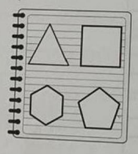

a) El pentágono y el hexágono.
b) El cuadrado y el triángulo.
c) Solamente el triángulo. (correcta)
d) Solamente el cuadrado.

## Pregunta 16

Según el Ministerio de Industria y Comercio el precio del barril del petróleo y el precio del galón de gasolina están relacionados, de tal forma que si el precio del primero disminuye el precio del segundo también lo hace y si el precio del primero aumenta también lo hace el segundo. Esta relación podría ser

a) inversamente proporcional.
b) directamente proporcional. (correcta)
c) constante.
d) oscilante.

## Pregunta 17

A un número positivo x se le resta 3. El valor obtenido se eleva al cuadrado y, finalmente, el valor obtenido se divide entre 2. Si el resultado final es igual a 8, ¿cuál es el valor de x?

a) 18
b) 11
c) 7 (correcta)
d) 5

## Pregunta 18

La gráfica muestra tarifas de pasajes de ida y vuelta entre distintos pares de ciudades. ¿Para cuál o cuáles pares de ciudades se puede encontrar una tarifa de $360?

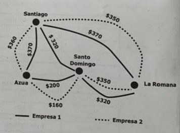

a) Azua - Santiago únicamente.
b) Azua - Santiago y Azua - Santo Domingo únicamente.
c) Santo Domingo - Azua únicamente.
d) Santo Domingo - Azua y Santiago - La Romana únicamente. (correcta)

## Pregunta 19

La tabla muestra, para 4 animales de una misma especie, la cantidad de crías y la edad de cada uno de ellos. 

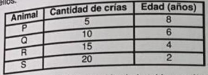

De acuerdo con la información de la tabla, ¿cuál de las siguientes afirmaciones es verdadera?

a) Entre menor es la edad del animal, menor es la cantidad de crías.
b) La cantidad de crías siempre es mayor que la edad del animal.
c) Entre menor es la edad del animal, mayor es la cantidad de crías. (correcta)
d) La cantidad de crías siempre es menor que la edad del animal.

## Pregunta 20

Diana y Marcela comparten un apartamento en alquiler. De los costos del apartamento, Diana debe pagar el triple que Marcela. En el último mes los costos fueron de $30,000 por lo tanto Marcela debe pagar $10,000. ¿Es verdadero que Marcela debe pagar esta cantidad?

a) Sí, porque la tercera parte de los costos corresponden a $10,000. (correcta)
b) Sí, porque la parte que paga Diana es superior a la que paga Marcela.
c) No, porque Diana pagaría menos del triple de lo que paga Marcela.
d) No, porque Diana pagaría más del triple de lo que paga Marcela.

## Pregunta 21

Una compañía va a lanzar un video juego en línea y realizó un estudio que arrojó los datos en un gráfico. 
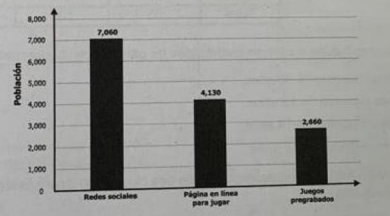

Dada la información del gráfico, ¿cuál de las siguientes tablas representa los resultados del estudio?
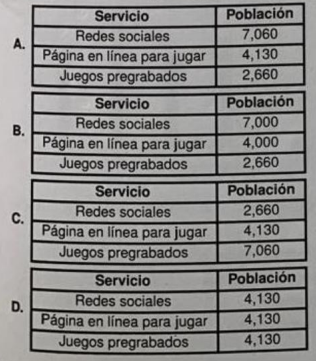

a) Servicio: Redes sociales 7,060; Página en línea 4,130; Juegos pregrabados 2,660. (correcta)
b) Redes sociales 7,000; Página 4,000; Juegos 2,660.
c) Redes sociales 2,660; Página 4,130; Juegos 7,060.
d) Todos 4,130.

## Pregunta 22

Una cooperativa hace préstamos a sus socios. La tabla muestra información de cuatro de ellos. 
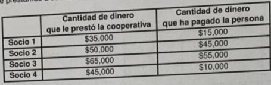

Según la tabla, ¿cuál socio le debe menos dinero a la cooperativa?

a) El socio 1.
b) El socio 2. (correcta)
c) El socio 3.
d) El socio 4.

## Pregunta 23

En una actividad se realizará la rifa de un electrodoméstico. La tabla muestra el conteo de los presentes. 
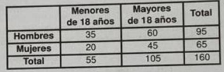

Según la tabla, ¿quienes tienen mayor probabilidad de ganar el electrodoméstico?

a) Los hombres mayores de 18 años. (correcta)
b) Las mujeres menores de 18 años.
c) Los hombres menores de 18 años.
d) Las mujeres mayores de 18 años.

## Pregunta 24

Los gráficos muestran la temperatura promedio de una ciudad y el dinero gastado en energía eléctrica en los hogares, en períodos trimestrales. Con base en la información de los gráficos, ¿cuál de las siguientes afirmaciones es verdadera?

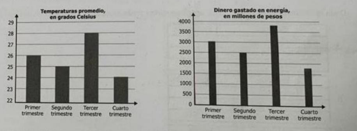

a) A menor temperatura mayor es el dinero gastado en energía eléctrica.
b) A mayor temperatura mayor es el dinero gastado en energía eléctrica. (correcta)
c) El consumo de energía es independiente de la temperatura.
d) El consumo de energía es constante sin importar la temperatura.

## Pregunta 25

María está interesada en saber cuál es la altura de un gran árbol de navidad. Para ello realiza un proceso. ¿Cuál paso se debe realizar para determinar la altura?

Para ello realiza el siguiente proceso:
Paso 1. Mide la longitud (L) de la circunferencia de la base para determinar su radio (r = L/2pi)

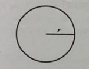

Paso 2. Mide el ángulo de elevación que forma el radio con el lado inclinado hasta la parte más alta. 

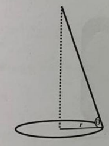

a) Multiplicar r por arcos θ.

b) Multiplicar r por tan θ. (correcta)

c) Dividir r entre cos θ.

d) Dividir r entre arcotan θ.

## Pregunta 26

En un estudio se preguntó a varios jóvenes por el tiempo de permanencia en diferentes redes sociales. Los tiempos promedio de uso de cada red se muestran en la tabla. 

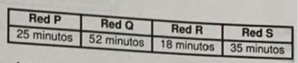

¿A cuál red le dedican menos tiempo promedio los jóvenes del estudio?

a) Red P
b) Red Q
c) Red R (correcta)
d) Red S

## Pregunta 27

El gráfico detalla las ventas de electrodomésticos durante un fin de semana en una tienda. 

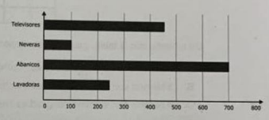

¿Cuál de las siguientes tablas muestra la misma información que el gráfico?
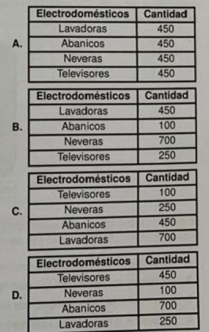

a) Todas 450.
b) Lavadoras 450, Abanicos 100, Neveras 700, Televisores 250. (correcta)
c) Televisores 100, Neveras 250, Abanicos 450, Lavadoras 700.
d) Televisores 450, Neveras 100, Abanicos 700, Lavadoras 250.

## Pregunta 28

Luisa tiene el compromiso de trabajar 40 horas en la semana (de lunes a viernes). Su supervisor lleva un control de horas trabajadas por días: lunes 7, martes 5, miércoles 7, jueves 8. 

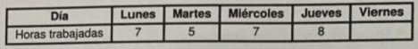

¿Cuántas horas tiene que trabajar el viernes para cumplir con su compromiso?

a) 40
b) 13 (correcta)
c) 8
d) 7

## Pregunta 29

Un biólogo marino estudia 4 ballenas jorobadas. La tabla muestra algunas características. De acuerdo con la tabla, ¿cuál de las siguientes afirmaciones es verdadera?

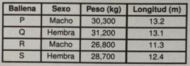

a) La ballena con el menor peso es macho. (correcta)
b) La ballena con el mayor peso es macho.
c) La ballena con la menor longitud es hembra.
d) La ballena con la mayor longitud es hembra.

## Pregunta 30

En una competencia de natación debe completarse un circuito triangular en dos etapas. La competencia exige que el circuito comience por la etapa más larga, por lo que un participante decide comenzar por la etapa arrecife. ¿Es correcta su elección?

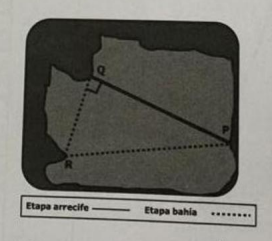

a) Sí, porque la etapa arrecife corresponde al lado más largo del triángulo.
b) No, porque los catetos del triángulo forman parte de la etapa bahía.
c) Sí, porque el lado del triángulo que corresponde con la etapa arrecife es igual a la suma de los otros dos catetos.
d) No, porque la etapa bahía equivale a la suma de dos lados de un triángulo, que es mayor que el lado restante. (correcta)

## Pregunta 31

Para rotular los automóviles una compañía está usando los números de la secuencia 5, 9, 13, 17... Un empleado dice que para el décimo auto el número del rótulo se obtiene como sigue. Con el procedimiento planteado por el empleado ¿puede encontrarse el número del rótulo del décimo auto?

a) Sí, porque la secuencia de números siempre va aumentando.
b) Sí, porque la sucesión se genera sumando una cantidad constante al término anterior. (correcta)
c) No, porque en una sucesión no debe hallarse la diferencia entre dos de sus términos.
d) No, porque la suma debe hacerse antes de la multiplicación.

## Pregunta 32

En un terreno cuadrado se quieren sembrar 2 × 25 × 25 semillas. Para lograr esto, un agricultor propone un procedimiento pero le falta un paso. ¿Cuál debe ser el paso 2 que completa el procedimiento?

a) Dividir en 4 secciones cada cuadrado.
b) Sembrar 23 semillas en cada sección.
c) Dividir cada cuadrado en 25 secciones. (correcta)
d) Sembrar 50 semillas en cada cuadrado.

## Pregunta 33

Juan repartió $120,000 entre sus cuatro hijos proporcionalmente a la edad que tiene de la forma siguiente:
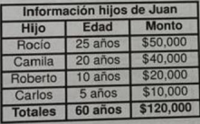

Felipe decide repartir $225,000 a sus cuatro hijos de la misma forma que hizo Juan. 
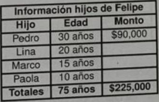

¿Cuánto dinero recibiría Marco?

a) $15,000
b) $20,000
c) $30,000
d) $45,000 (correcta)

## Pregunta 34

Para numerar un conjunto de piezas se generó la siguiente secuencia: 3, 10, 31, 94, 283... ¿Cuál es la regla de formación de la secuencia?

a) Multiplicar por 3 el número anterior y sumar 1. (correcta)
b) Multiplicar por 4 el número anterior y restar 2.
c) Sumar 7 al número anterior.
d) Restar 7 al número anterior.

## Pregunta 35

El siguiente diagrama de árbol muestra la distribución de tortas vendidas por una pastelería durante el mes pasado. 
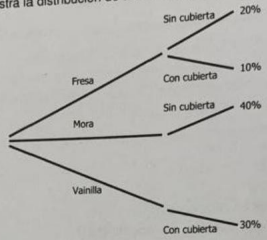

¿Cuál de las siguientes tablas muestra correctamente la información del diagrama de árbol?
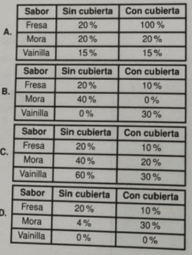

a) Fresa: 20% sin, 100% con; Mora: 20% sin, 20% con; Vainilla: 15% sin, 15% con.
b) Fresa 20% sin, 10% con; Mora 40% sin, 0% con; Vainilla 0% sin, 30% con.
c) Fresa 20% sin, 10% con; Mora 40% sin, 20% con; Vainilla 60% sin, 30% con. (correcta)
d) Fresa 20% sin, 10% con; Mora 4% sin, 30% con; Vainilla 0% sin, 0% con.

## Pregunta 36

Carla sugirió que para celebrar la graduación, cada estudiante ahorre $30 diarios. Para calcular la cantidad de dinero que tiene ahorrado cada estudiante, se utiliza la fórmula F(n) = 30n. ¿Por qué es correcta la fórmula utilizada?

a) Porque durante n meses se suma $30 de cada estudiante.
b) Porque cada día se suma la misma cantidad de $30 y se hace durante n días. (correcta)
c) Porque se tiene en cuenta los 30 días del mes y así se sabe el total del ahorro.
d) Porque se debe dividir entre 30 para hallar la cantidad total ahorrada por cada estudiante.

## Pregunta 37

Hay dos cajas con las siguientes dimensiones. 
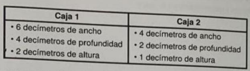

¿Cuál es la diferencia entre los volúmenes de las cajas, en decímetros cúbicos?

a) 16
b) 19
c) 40 (correcta)
d) 56

## Pregunta 38
Para calcular el dinero total M que se obtiene al invertir una cantidad inicial C, a una tasa de interés fija del 5% durante un tiempo t, se utiliza la fórmula M = C(1.05)^t. 

¿Con cuál de las siguientes opciones se puede calcular el tiempo necesario para que la cantidad final sea igual al triple de la cantidad inicial?

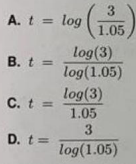

a) t = log(3/1.05)
b) t = log(3)/log(1.05) (correcta)
c) t = log(3)/1.05
d) t = 3/log(1.05)

## Pregunta 39

Una pintura hecha sobre una tela cuadrada de 80 cm de lado se pega sobre una tabla de madera, dejando un marco de 10 cm de ancho alrededor de la pintura. ¿Es correcta esta solución?

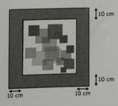

a) No, porque está suponiendo que los dos lados de la tabla miden lo mismo.
b) Sí, porque al área de la tabla le sumó el área de la pintura.
c) No, porque hace falta restarle el área que ocupa la pintura. (correcta)
d) Sí, porque está contemplando la medida completa del lado de la tabla.

## Pregunta 40

Cierta especie de árbol crece 2 cm cada 6 meses. ¿Cuál de las siguientes expresiones permite calcular la altura del árbol en un tiempo t determinado en meses?

a) t^3
b) t/3 (correcta)
c) t + 6
d) t - 6

## Pregunta 41

Se busca numerar un dado de seis caras en el que la probabilidad de sacar un número mayor que 4 sea de 2/3. ¿Cuál de los siguientes dados cumple con estas condiciones?

a) 1, 1, 1, 1, 5, 6
b) 1, 4, 4, 5, 5, 6
c) 1, 1, 5, 5, 6, 6
d) 1, 5, 5, 6, 6, 6 (correcta)

## Pregunta 42

La tabla muestra los ingresos que ha tenido una tienda en los últimos tres meses por la venta de un producto: mes1 $1,000, mes2 $2,000, mes3 $6,000. 
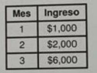

¿Cuál es la mediana de ingresos de la tienda en los tres meses?

a) $2,000 (correcta)
b) $3,000
c) $6,000
d) $11,000